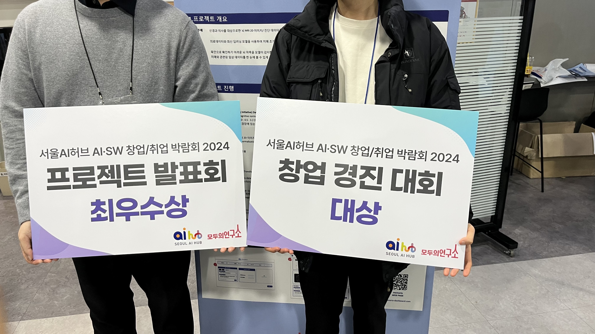

# MEMORIA_AI



## 프로젝트 소개
- 치매 진단을 목표로 다양한 딥러닝 모델을 적용
- Django, Web 개발, Figma를 활용하여 AI 팀과 UX/UI 팀이 협업한 종합 프로젝트
- 라틴어로 '기억(Memoria)'을 의미, 기억을 지키기 위한 AI 개발

## 팀원
| 이정수 | 최영환 | 김건 | 정민지 | 박지은 | 이예림 |
|:---|:---|:---|:---|:---|:---|
| [GitHub](https://github.com/sw930718) | [GitHub](https://github.com/cyh5757) | [GitHub](https://github.com/Polar-Bear-Poby) | [GitHub](https://github.com/dustywindow) | [GitHub](https://github.com/JiEuNparrk) | [GitHub](https://github.com/yeliiim) |

## 성과
- 창업 경직 대회 대상
- 프로젝트 발표회 최우수상

## 파일 구조
```
MEMORIA_AI/
├── img/
│   └── award.jpg
├── InceptionResNetV2/
│   ├── tensor_py/  (TensorFlow 버전)
│   └── torch_py/   (PyTorch 버전)
├── PatchSVDD/
│   ├── codes/      (Patch-based Anomaly Detection)
├── Transformer/
│   └── (VisionTransformer, SwinTransformer)
├── EDA.ipynb       (데이터 탐색)
├── preprocessing.py (전처리 스크립트)
├── sharpening_png.py (이미지 색인 가장)
├── README.md
```
